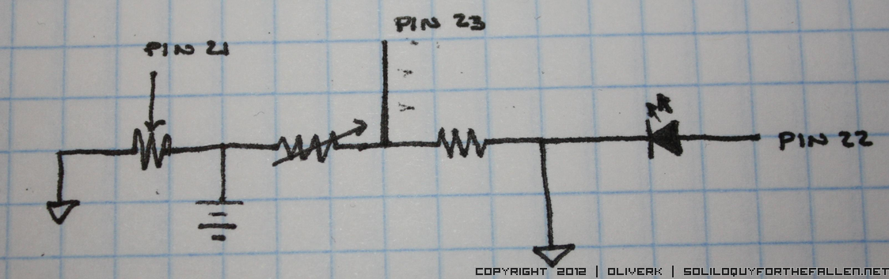

#Clicker Project
This is a project that uses a teensy 3.0 and a laser pointer to advance slides.  Why?  Because I have a laser pointer and a teensy and I don't want to spend the money to buy a clicker and then have a teensy, laser pointer, and clicker.

##Parts
+ Teensy 3.0
+ USB A to Micro B cable (I didn't have one so I still had to order SOMETHING)
+ 0 to 1k ohm LDR
+ 0 to 1k ohm potentiometer
+ LED
+ resistor
+ Laser pointer

##Assembly
I just deadbugged mine together.  Here's schematic on how it should be put together.  I will not apoligize for the neatly drawn and lettered schematic.

Oh, there should be a resistor in front of that LED.  Oops.

##Usage
1. Start a text editor.
1. Adjust the pot until it takes the laser pointer to get the computer to type "n" into the text editor.
1. Setup your powerpoint system to use "N" to advance to the next slide.

_Alternate Usage_
Change the source code to whatever key you need.

##Todo
Nothing! Hah!

##License
This is licensed under the use it don't steal it idea.  You didn't write it, so don't say or act like you did.  Use it if its useful, leave it if its not.
>>>>>>> 9b126c8daf8dc5b10cc93307640421eab685c490

